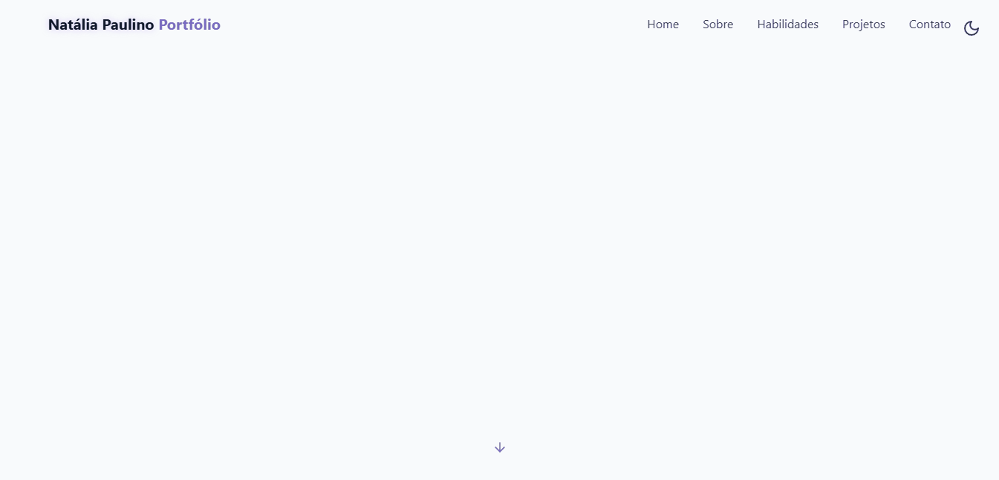

<h1 align="center" >Natália Paulino —  Portfolio</h1>
 

   Welcome to my personal portfolio — a sleek, modern React application designed to showcase my skills, projects, and professional journey.   
   <a href="https://nataliapaulino.github.io/" target="_blank">Live Version →</a>
 
 

---

## About This Portfolio

This portfolio showcases my skills and projects with a modern, sleek design and intuitive navigation. It includes:

- **Home:** Introduction and welcome message  
- **About Me:** Personal background and passions  
- **Skills:** Technologies and tools I maste 
- **Projects:** Highlights of my work and experiments  
- **Contact:** Easy ways to get in touch

---

##  Theme Toggle

|  | Switch to **Light Mode** for a clean, vibrant interface perfect for daylight browsing. |
|--------------------------------------------------------------------|--------------------------------------------------------------------------------------|
|  | Switch to **Dark Mode** to enjoy a magical starry night background with animated stars. |

---

## Built With

- **Node.js** — Development environment and build process
- **Vite** — Lightning-fast build tool and development server  
- **React** — Component-based UI framework  
- **Tailwind CSS** — Utility-first styling for rapid and responsive design  
- **JavaScript (ES6+)** — Core programming language  
- **Lucide Icons** — Crisp and customizable SVG icons  
- **Radix UI** — Accessible React UI primitives  

---

## Key Features

- Responsive design optimized for all screen sizes  
- Smooth dark/light mode toggle with animated starry background in dark mode  
- Clear, minimalistic UI focused on usability and aesthetics  
- Structured sections for easy navigation  
- Best practices for accessibility and performance

